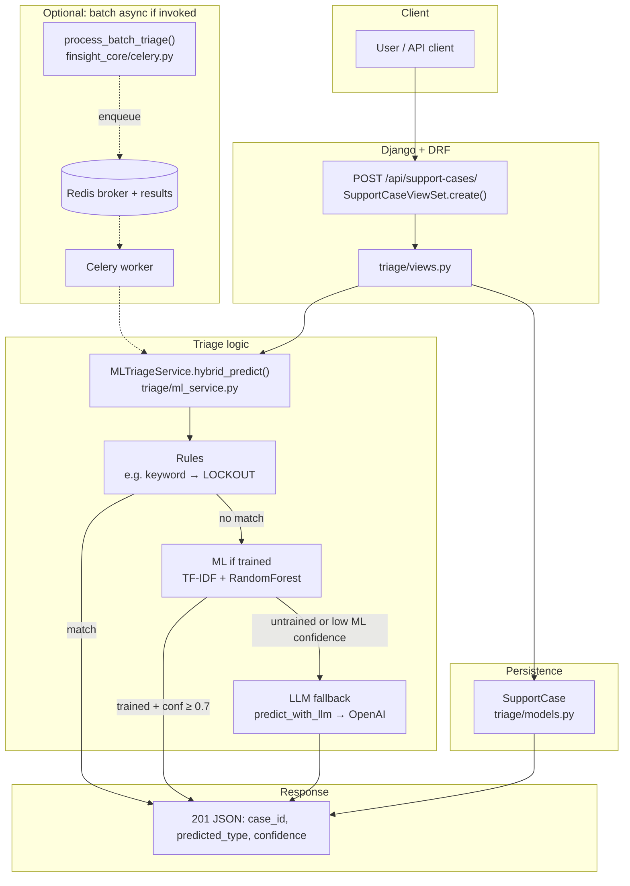
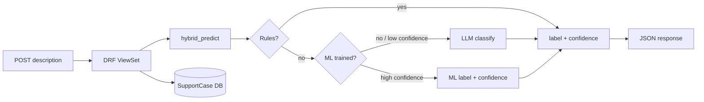

# Finsight — AI-assisted financial support-case triage (backend)

Finsight is a **Django/DRF backend** that ingests free-text customer support issues (ex: *“my account is locked”*, *“this card charge wasn’t me”*) and returns a **triage label** plus a **confidence score**. It also persists the case to Postgres so it can be reviewed, audited, and routed downstream.

At its core is a **hybrid triage pipeline**:

- **Rules first** for high-signal keywords (fast + deterministic)
- **Traditional ML** (TF‑IDF + RandomForest) for common patterns
- **LLM fallback** for ambiguous / low-confidence cases

## What it does

- **API**: Create a support case with a `description` and receive:
  - `predicted_type` (ex: `LOCKOUT`, `FRAUD`, `DISPUTE`, `OTHER`)
  - `confidence` (float)
  - `case_id` (stored identifier)
- **Persistence**: Stores each case (and optionally interactions) in Postgres.
- **Batch/async mode**: A Celery task can triage a list of descriptions and return structured results.

## High-level flow (request → prediction → persistence)

1. A client POSTs a support case description to the API.
2. The API calls `MLTriageService.hybrid_predict(description)`.
3. `hybrid_predict`:
   - runs lightweight **rule checks**
   - otherwise runs the **ML classifier**
   - if ML confidence is below a threshold, calls the **LLM classifier**
4. The API persists the result to `SupportCase` and returns the response JSON.

## Architecture diagram

GitHub renders fenced `mermaid` blocks in Markdown (e.g. this `README` on the repo home page). If a diagram does not show, use [Mermaid Live](https://mermaid.live) to preview or export PNG/SVG.



Simplified one-lane view:



## Main modules and where to look in code

- **API layer (DRF)**: `triage/views.py`
  - `SupportCaseViewSet.create()` is the main entry point for online triage.
- **Hybrid ML/LLM triage logic**: `triage/ml_service.py`
  - `train_model(...)`: trains TF‑IDF + RandomForest from a CSV with `description` + `label`
  - `hybrid_predict(...)`: rules → ML → LLM fallback
  - `predict_with_llm(...)`: calls OpenAI to classify the case text
- **Domain model (what gets saved)**: `triage/models.py`
  - `SupportCase`: description, predicted type, confidence, timestamps
  - `CaseInteraction`: optional message log per case
- **Async/batch triage**: `finsight_core/celery.py`
  - `process_batch_triage(case_descriptions)`: triages a list in a worker process
- **Runtime config**: `finsight_core/settings.py`
  - Postgres config, Celery broker/backend, Django settings
- **Containerized dev**: `docker-compose.yml`, `Dockerfile`
  - `web` (Django via gunicorn), `db` (Postgres), `redis`, `worker` (Celery)

## Run locally (Docker Compose)

### Prereqs

- Docker Desktop
- An OpenAI API key (set in `.env`)

### Start services

```bash
docker compose up --build
```

This starts:

- **web**: `localhost:8000`
- **db**: Postgres
- **redis**: broker/backing store for Celery
- **worker**: Celery worker for async triage

## API usage (example)

The create flow expects a JSON body with `description`.

```bash
curl -X POST http://localhost:8000/api/support-cases/ \
  -H "Content-Type: application/json" \
  -d '{"description":"I think my account got locked after too many attempts"}'
```

Example response shape (from `triage/views.py`):

```json
{
  "case_id": "…",
  "predicted_type": "LOCKOUT",
  "confidence": 0.95
}
```

## Training the ML model (optional)

`MLTriageService.train_model(training_data_path)` expects a CSV with:

- `description`: text
- `label`: class label

It returns an accuracy score on a held-out split.

## Notes

- **Celery**: `process_batch_triage` is defined but not wired from the API yet; enqueue it when you need batch triage off the request thread.
- **Docker healthcheck**: `docker-compose.yml` uses `curl` against `/health`; ensure `curl` exists in the image or adjust the healthcheck.
